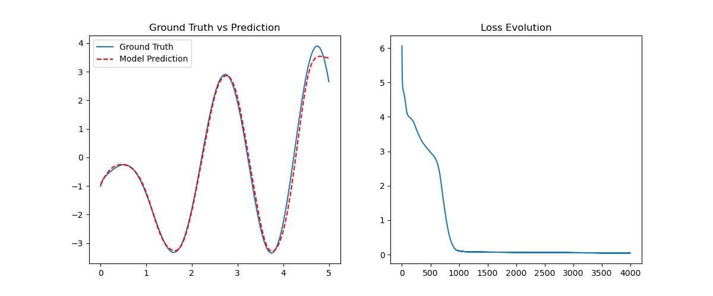
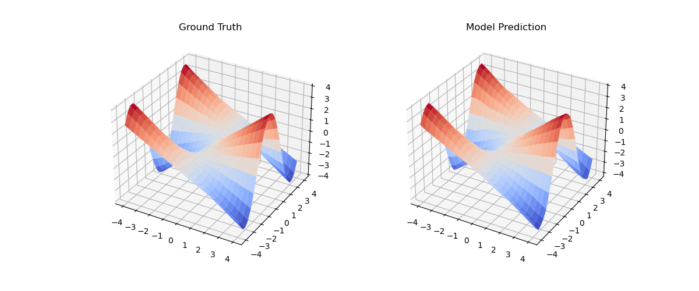
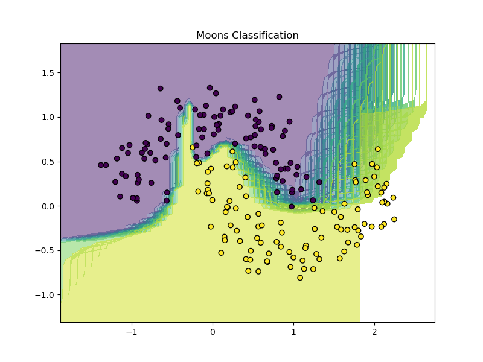
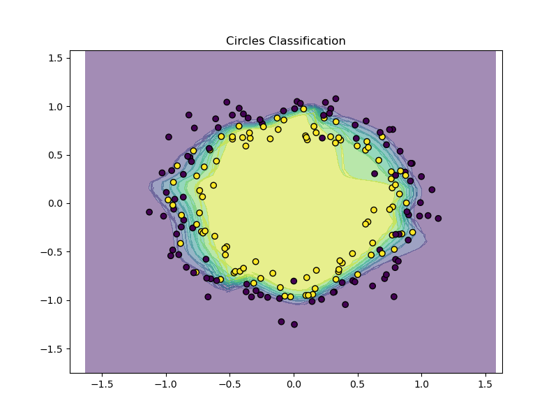
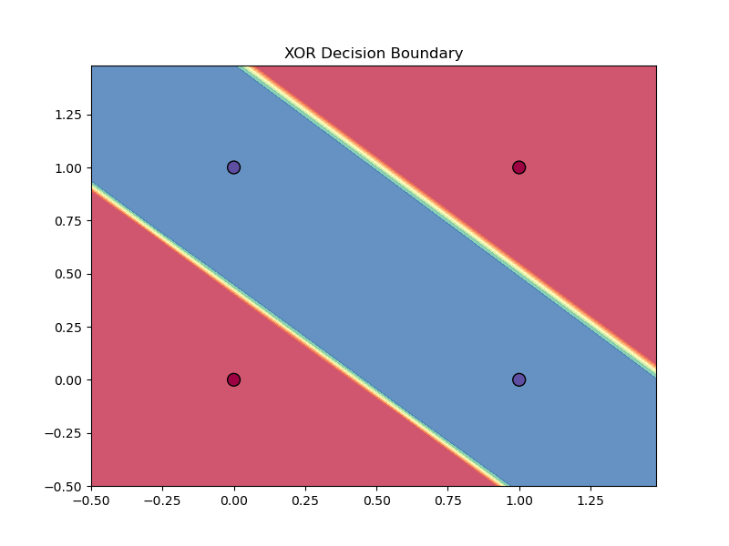
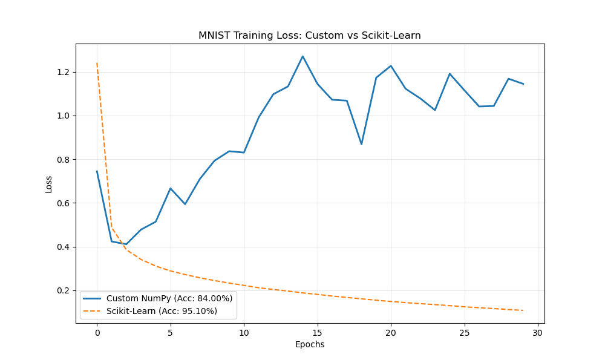

# Neural Network from Scratch with NumPy

This project is a deep dive into the mathematical and algorithmic foundations of Deep Learning. It demonstrates how to build a fully functional Deep Neural Network (DNN) from the ground up using only **NumPy**, without the use of high-level libraries like PyTorch or TensorFlow.

## 🖼️ Gallery of Results

Below are some results generated by the examples included in this repository, showing the model's ability to solve non-linear problems.

| 1D Regression | 2D Surface Approximation |
|:---:|:---:|
|  |  |
| *Approximating a complex curvy function* | *Estimated vs. Ground Truth surface* |

| Moons Classification | Circles Classification |
|:---:|:---:|
|  |  |
| *Non-linear decision boundary* | *Deep networks capturing complex shapes* |

| XOR Logic Gate | MNIST Benchmark |
|:---:|:---:|
|  |  |
| *Solving the XOR problem* | *Custom model vs. Scikit-Learn* |

## 📂 Project Structure

```text
.
├── documentation/            # Original theory PDF (FR)
├── neural_network_numpy/     # 🧠 Core package implementation
│   ├── activations.py        # Sigmoid, ReLU, Tanh, Linear
│   ├── losses.py             # MSE, Log-Loss (BCE)
│   ├── layer.py              # Modular Layer abstraction
│   ├── model.py              # NeuralNetwork orchestrator
│   └── utils.py              # Visualizations & data processing
├── theories/                 # 📚 Detailed Math Documentation (EN)
├── figures/                  # 📊 Saved training results
├── examples/                 # 🚀 Python scripts for reproduction
├── test/                     # ✅ Unit tests for all components
├── notebooks/                # 📓 Interactive demonstrations
└── README.md
```

## 📚 Deep Dive into Theory

We have translated and expanded the original theoretical PDF into several easy-to-follow chapters:

1.  **[Introduction: The Quest for AI](theories/01_introduction.md)** - Project motivation and roadmap.
2.  **[Anatomy of a Neuron](theories/02_anatomy_of_a_neuron.md)** - Biological analogies and basic math.
3.  **[Activation Functions](theories/03_activation_functions.md)** - Why we need non-linearity.
4.  **[Forward Propagation](theories/04_forward_propagation.md)** - The flow of information.
5.  **[Loss Functions](theories/05_loss_functions.md)** - Measuring mistakes.
6.  **[Backpropagation](theories/06_backpropagation.md)** - The chain rule and gradient calculation.
7.  **[Optimization Algorithms](theories/07_optimization_algorithms.md)** - Gradient Descent and RMSprop.

## ✨ Features

- **Modular Architecture**: Decoupled layers and activation functions allow for any network depth and width.
- **Advanced Optimization**: Implements **RMSprop** (Root Mean Square Propagation) for faster and more stable convergence compared to standard SGD.
- **Vectorized Math**: Heavy use of NumPy matrix operations for efficient calculations.
- **Unit Tested**: Core mathematical blocks are fully tested with `pytest`.

## ⚙️ Installation

```bash
# Clone the repository
git clone https://github.com/yourusername/Neural-Network-Scratch.git
cd Neural-Network-Scratch

# Install dependencies
pip install numpy pandas plotly scikit-learn pytest
```

## 🚀 Quick Start

```python
from neural_network_numpy import NeuralNetwork
from neural_network_numpy.activations import sigmoid, relu
from neural_network_numpy.losses import log_loss, dlog_loss

# 1. Initialize a model
model = NeuralNetwork(input_dim=2)

# 2. Add layers
model.add_layer(16, activation=relu)
model.add_layer(1, activation=sigmoid)

# 3. Train
model.fit(X_train, y_train, epochs=2000, lr=0.01, loss_fn=log_loss, dloss_fn=dlog_loss)

# 4. Predict
predictions = model.forward(X_test)
```

## ✅ Running Tests

To ensure everything is working correctly, run the unit tests:

```bash
PYTHONPATH=. pytest test/
```

## 👨‍💻 Author
**Moussa Seydi Faye** - Mathematician & Numerical Engineer
Check out the original project goal in `documentation/neural-network-with-numpy-theory.pdf`.
