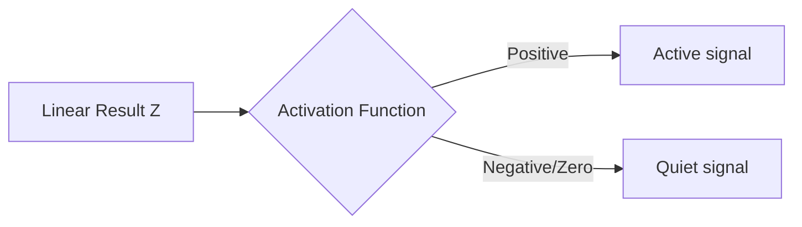

# 03 - Activation Functions: The Voice of the Neuron

Activation functions are the "gatekeepers". They decide whether a neuron's signal should be loud, quiet, or silenced entirely.

## Why do we need them?

Without non-linear activation functions, a neural network—no matter how many layers it has—would behave exactly like a single-layer linear model. Non-linearity allows the network to learn complex patterns like curves, circles, and intricate boundaries.

## Common Activation Functions

### 1. Sigmoid
The classic "S-curve". It squashes any input into a range between **0 and 1**.
$$ \sigma(x) = \frac{1}{1 + e^{-x}} $$

- **Best for:** Binary classification (outputting a probability).
- **Pros:** Smooth gradient, clear interpretation as probability.
- **Cons:** **Vanishing Gradient** - for very large or very small $x$, the curve becomes very flat, meaning the gradient is nearly zero, and the model stops learning.

### 2. ReLU (Rectified Linear Unit)
The modern favorite. It's incredibly simple: if $x$ is positive, return $x$; otherwise, return 0.
$$ f(x) = \max(0, x) $$

- **Best for:** Hidden layers in almost all modern networks.
- **Pros:** Extremely fast to compute. Avoids vanishing gradients for positive values.
- **Cons:** **Dying ReLU** - neurons can "die" if they only receive negative values (output 0 forever).

### 3. Tanh (Hyperbolic Tangent)
Similar to Sigmoid but squashes values between **-1 and 1**.
$$ f(x) = \tanh(x) = \frac{e^x - e^{-x}}{e^x + e^{-x}} $$

- **Best for:** Hidden layers where you want the data to be centered around zero.
- **Pros:** Stronger gradients than Sigmoid.

## Visualization

> [!IMPORTANT]
> **Which one to choose?**
> A good rule of thumb: Use **ReLU** for hidden layers and **Sigmoid** for the final output layer in binary classification.

Next, we see how these components work together in **[Forward Propagation](04_forward_propagation.md)**.
