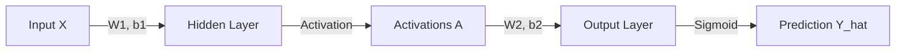

# 04 - Forward Propagation: The Flow of Information

Forward propagation is the process of passing input data through the network to get a prediction. Think of it as a **relay race** where information is passed from one layer to the next.

## Terminology
- **Input ($X$):** Your raw data (e.g., pixel values of an image).
- **Layer ($l$):** A group of neurons working in parallel.
- **Hidden Layers:** Layers between the input and output. They "hide" intermediate calculations.
- **Output ($\hat{y}$):** The final prediction of the network.

## The Walkthrough

Imagine a network with 2 inputs, one hidden layer of 3 neurons, and 1 output.

### Step 1: Input to Hidden Layer
Data enters the first layer. For each neuron in the hidden layer, we calculate its linear part ($z$) and its activation ($a$).

In code:
```python
z1 = X @ W1.T + b1
a1 = relu(z1)
```

### Step 2: Hidden Layer to Output
The output of the first layer ($a1$) becomes the **input** for the next layer.

In code:
```python
z2 = a1 @ W2.T + b2
y_pred = sigmoid(z2)
```

## Matrix Math: Why it's fast
Instead of calculating one neuron at a time, we use matrices. This allows your computer (or GPU) to calculate thousands of neurons simultaneously using "Vectorization".



> [!NOTE]
> **Data Shape:** Notice that the number of columns in $W$ must match the number of inputs coming in. This is the "handshake" between layers.

Next, we need to know how "wrong" our prediction is using **[Loss Functions](05_loss_functions.md)**.
