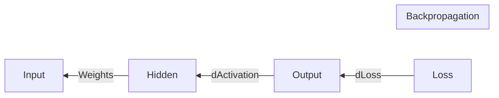

# 06 - Backpropagation: Learning by Mistakes

Backpropagation is often considered the "difficult" part of neural networks. However, once you understand the **Chain Rule** from calculus, it becomes a beautiful logic puzzle.

## The Intuition: "Who is to blame?"

Imagine you are a manager of a factory. The final product is wrong. 
- You look at the final assembly line (the Output Layer). 
- To fix the error, you need to know which worker on *that* line made a mistake.
- But those workers might say: "It's not my fault! I just worked with the parts I received from the previous line (the Hidden Layer)!"
- So, you trace the error back, layer by layer, to see how each weight and bias contributed to the final mistake.

## The Math: The Chain Rule

If you want to know how the **Loss ($\mathcal{L}$)** changes when you tweak a **Weight ($w_1$)**, you can't calculate it directly. You have to follow the path:

1. How much does $\mathcal{L}$ change if the **Output ($a$)** changes? $\left(\frac{\partial \mathcal{L}}{\partial a}\right)$
2. How much does the **Output ($a$)** change if the **Linear part ($z$)** changes? $\left(\frac{\partial a}{\partial z}\right)$
3. How much does the **Linear part ($z$)** change if the **Weight ($w$)** changes? $\left(\frac{\partial z}{\partial w}\right)$

Multiply them together, and you get your answer:
$$ \frac{\partial \mathcal{L}}{\partial w} = \frac{\partial \mathcal{L}}{\partial a} \cdot \frac{\partial a}{\partial z} \cdot \frac{\partial z}{\partial w} $$

## The Error Term ($\delta$)

To make things efficient, we define $\delta$ as the "error signal" for a layer:
$$ \delta = \frac{\partial \mathcal{L}}{\partial z} $$

Once we have $\delta$ for the last layer, we can calculate $\delta$ for the previous layer using the weights:
$$ \delta^{l} = (\delta^{l+1} \cdot W^{l+1}) \cdot \sigma'(z^l) $$

## Why do we "Go Back"?

We go backward because the gradient of a layer depends on the results of the layer *after* it. By starting at the end, we can calculate all gradients in a single pass!

> [!IMPORTANT]
> **Key Takeaway:** Backpropagation doesn't *update* the weights. It only *measures* how much each weight needs to change. The actual update is done by the **[Optimization Algorithm](07_optimization_algorithms.md)**.
